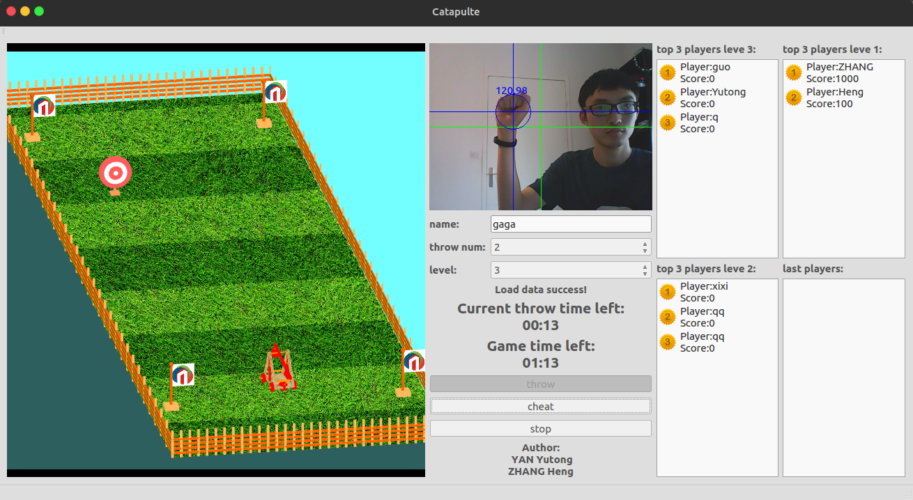

# Projet 3D (Catapulte)

- Author: YAN Yutong & ZHANG Heng

## Spécification de l’interface graphique	

L’interface graphique de notre projet est présente au-dessous :

1. Pour commencer, vous devez remplir votre nom, le nombre de coup que vous voulez jouer, et le niveau de difficulté. Ensuite, vous cliquez sur le Button **<start>** pour lancer le jeu. 
2. Si les informations que vous avez remplies sont tous valides, vous allez voir que la fenêtre en temps réel est activée et ça va détecter votre poing. Si le poing est détecté, il y aura un cercle bleu qui est superposé sur votre poing. Sinon, le cercle sera rouge pour vous indiquer que le poing n’est pas détecté.
3. Vous pouvez ajuster l’angle et la force de trébuchet. Le Button **<cheat>** peut vous aider en afficher la direction du jet devant le trébuchet. Quand vous avez fini l’ajustage, vous pouvez lancer votre trébuchet. 
4. Pour le lancer, vous devez justement ouvrir votre paume. Le projectile sera lancé automatiquement quand le paume est détecté à la même position du poing. 
5. Quand le projectile est tombé à la cible ou le sol, il y aura une fenêtre pour vous préciser la distance entre le projectile et le centre de la cible. Le score sera noté par le maximum entre dix moins la distance et zéro. $$Score = max (10-diantance, 0).$$
6. Après un certain nombre de coup de lancement du projectile, vous allez voir votre note finale. Elle sera affiche dans la liste **<last players>** en bas à droite de l’interface. Si votre score est supérieur que le score du top3, la liste de **<top 3 players> **sera mis à jour. 

## Conception

### Diagramme des classes

Il y a 3 parties principales dans notre programme :

1. Une partie pour l’organisation de jeu,
2. Une partie pour la gestion de la scène 3D,
3. Une parte pour l’affichage de l’interface.

#### Dans la partie de **l’organisation de jeu**

1. La classe **Detector** permet de détecter le poing ou la paume en utilisant l’algorithme Viola-Jones. 
2. La. a classe **Match** permet de gérer un match avec les paramètres nécessaires (nom de l’utilisateur, le nombre de coup que vous voulez jouer, et le niveau de difficulté).
3. La classe **Throw** permet de gérer un coup de lancement avec les coordonnées et la hauteur aléatoire selon le niveau de difficulté choisi. 

####  Dans la partie de **la gestion de la scène 3D**

1. La classe **MyGLWidget** permet d’initialiser la scène 3D et afficher les modèles 3D dans la scène 3D.
2. La classe **Trebuchet** permet de tracer le trébuchet dans la scène 3D avec plusieurs paramètres (angle de rotation de trébuchet, angle du bras oscillant, etc.).
3. La classe **Floor** permet de tracer la pelouse, les grilles, le ciel, etc.
4. La classe **ToolOpenGL** est le <driver> de la bibliothèque OpenGL. Elle contient les méthodes comme : **drawBox**, **drawSphere**, etc. Elle est l'encapsulation de la bibliothèque OpenGL. Nous avons le réaliser pour faciliter notre programme et faire la partie de modèle (le trébuchet et la pelouse) indépendante avec la bibliothèque 3D utilisée (OpenGL dans ce cas).
5. La classe **ToolImage** permet de réaliser une série de traitement simple d’image, comme **resizeImage**, **flipImage**, etc. 

#### Dans la partie de **l’interface graphique**,

1. La classe **MainWindow** permet d’afficher correctement les éléments visuels, comme la scène 3D, la fenêtre en temps réel, la liste du match, etc.

### Détection du poing et de la paume

Plus précisément, nous avons utilisé l’algorithme Viola-Jones pour la détection du poing et de la paume. Concrètement, cet algorithme est déjà intégré dans la bibliothèque **opencv**. Donc nous pouvons déclarer les détecteurs avec des classifieurs différents (pour le poing et pour la paume). Nous utilisons le classifieur de visage fourni par **opencv**, et ça va nous renvoyer les coordonnées du poing et de la paume détectée. 

### Principes physiques

Lorsque nous avons lancé le projectile, il y a 2 états possibles :

1. Avant la séparation, le projectile va suivre la corde,
2. Après la séparation, dans l’orientation verticale, c’est un mouvement de chute libre ; dans la direction horizontale, c’est un mouvement uniforme.

#### Pour le mouvement de chute libre dans l’orientation verticale :

Le déplacement vertical lv est en relation secondaire avec le temps t : $lv = a*t*t$

Donc la coordonnée de la hauteur de la projectile s est la hauteur du lancement h moins le déplacement vertical lv : $*z = h - lv = h - a*t*t,  a est un constant$

#### Pour le mouvement uniforme dans la direction horizontale :

La vitesse v est proportionnel à la position verticale du lancement, On met pos la coordonnée verticale de la position du poing, alors la vitesse v est : $v = b*pos + c, b et c sont des constants$

Du coup le déplacement horizontal lh est : $lh = v*t, t est le temps$

Donc le coordonnée du longueur de la projectile x est le longueur de lancement s plus le déplacement horizontal lh : $*x = s + lh = s + v*t = s + (b*pos + c)$ 

## L’état de finalisation de l’application

### Les fonctions validées :

1. Visualisation globale de la scène (avec les éléments suivants : trébuchet, filets de protection, sol en herbe, logo de TSE, éclairage), 
2. Animation du trébuchet pour fixer la rotation et l'inclinaison du bras, 
3. Animation du lancer du projectile avec mouvement dans les airs jusqu'à la cible, 
4. Gestion de l'apparition des cibles en fonction du niveau de difficulté, affichage du temps, du nombre de cibles restant et du score, 
5. Visualisation de l'image de la caméra et de la zone de captation du geste, 
6. Initialisation de l'interaction par un mouvement vertical vers le bas, 
7. Réglage du trébuchet en suivant le déplacement de la main : orientation du trébuchet par déplacement droite-gauche et inclinaison par déplacement haut-bas, 
8. Déclenchement du tir par déplacement rapide vers le bas. 

### Les fonctions pas finalisées :

Inconnu.

### Les bogues :

Inconnu.
